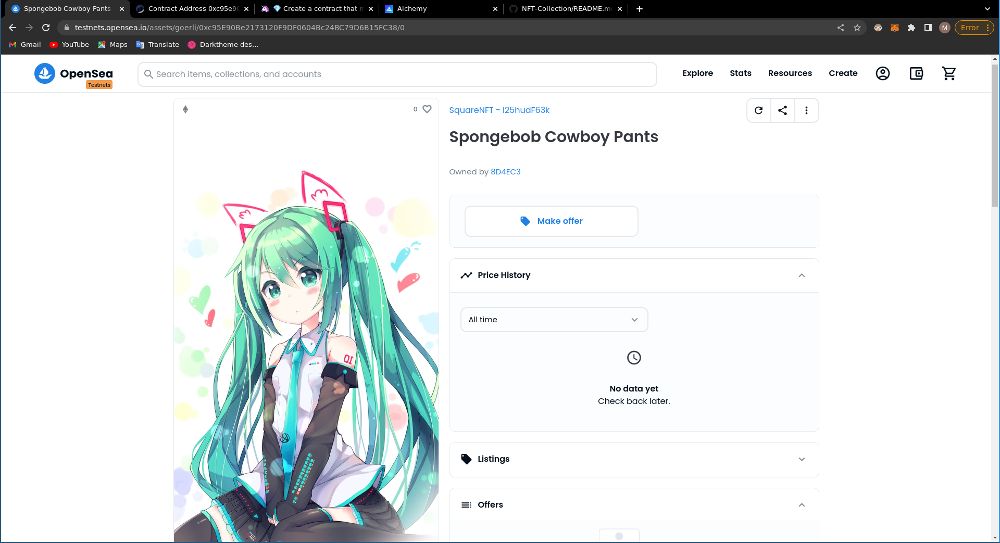
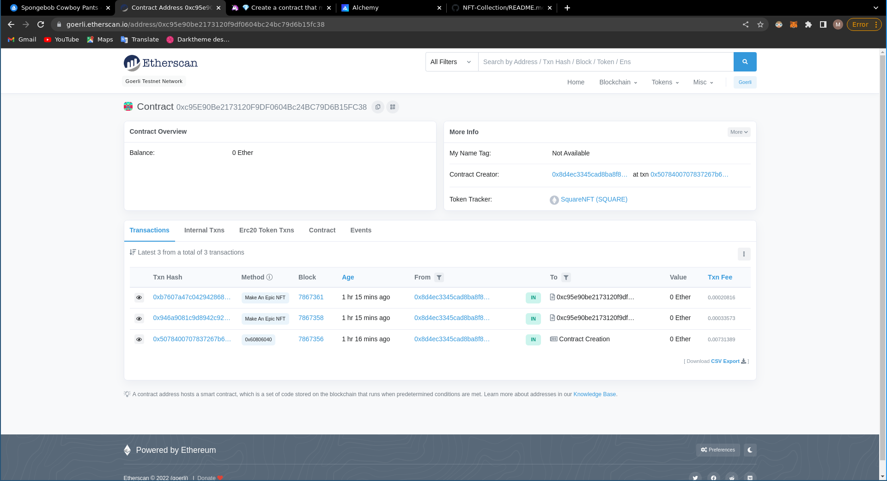

# NFT-Collection
web3 Project on blockchain technology 

 <a href="https://buildspace.so/p/mint-nft-collection/lessons/get-local-environment-running" target="_blank">buildspace</a> 
 
 
 
🦊 MINT YOUR FIRST NFT
4. 💎 Create a contract that mints NFTs
   - 🎉 Deploy to Goerli and see on OpenSea
        **used alchemy instead of quicknode**: 
        <a href="https://dashboard.alchemy.com/mempool">alchemy mempool</a> 
         

        **after deployed on OpenSea**: 
         <a href="https://testnets.opensea.io/assets/goerli/0xc95E90Be2173120F9DF0604Bc24BC79D6B15FC38/0">OpenSea NFT</a> 
         

       **EtherScan**: 
         <a href="https://goerli.etherscan.io/address/0xc95e90be2173120f9df0604bc24bc79d6b15fc38">OpenSea NFT</a> 
         
